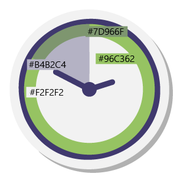
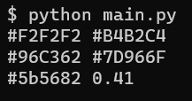

# Color Unblending

A really useful script for untangling combinations of three colors, when one of them is the overlay, and we need to find it and its alpha channel value.

We have an image (it's an SVG for reference, but what if it is not?):


What if we wanted to calculate the required RGBA value for this overlay segment?


Just find color codes for the two "base" and "overed" colors:



Feed them to the script in the format
```
#base1 #over1
#base2 #over2
```
and that's it:



Since we have an SVG, let's check the code confirm our guess:
```css
opacity: 0.41;
fill: #5B5682;
```

The script itself is nothing special, it is based on the formula 
`output = over + (base * (1.0 - overAlpha))` and uses functional-ish approach to calculations since it is just an experiment (so it can be slow).
